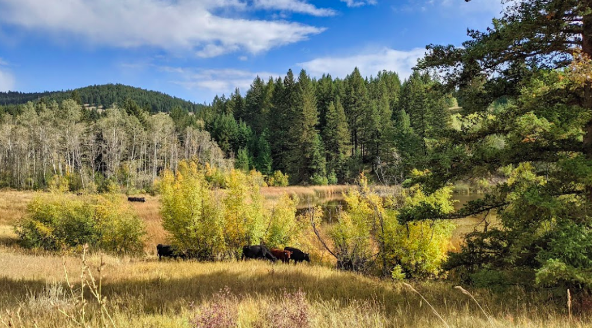
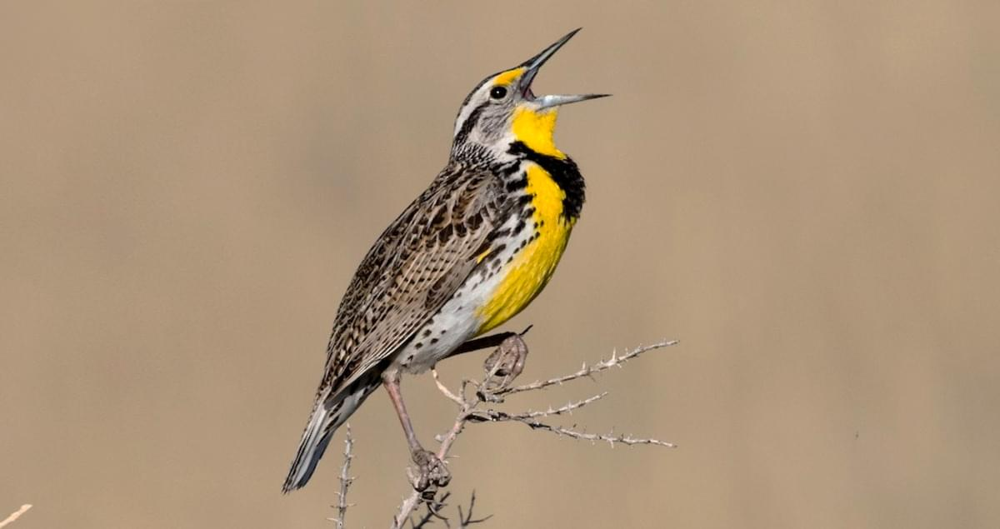
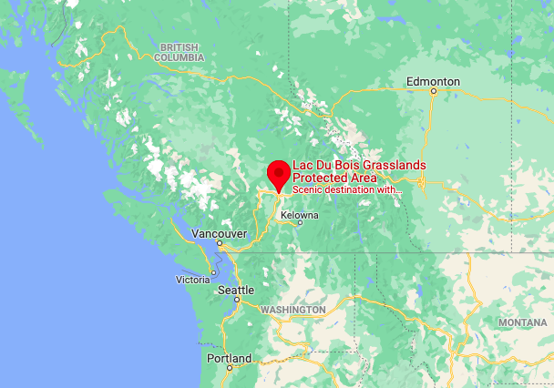
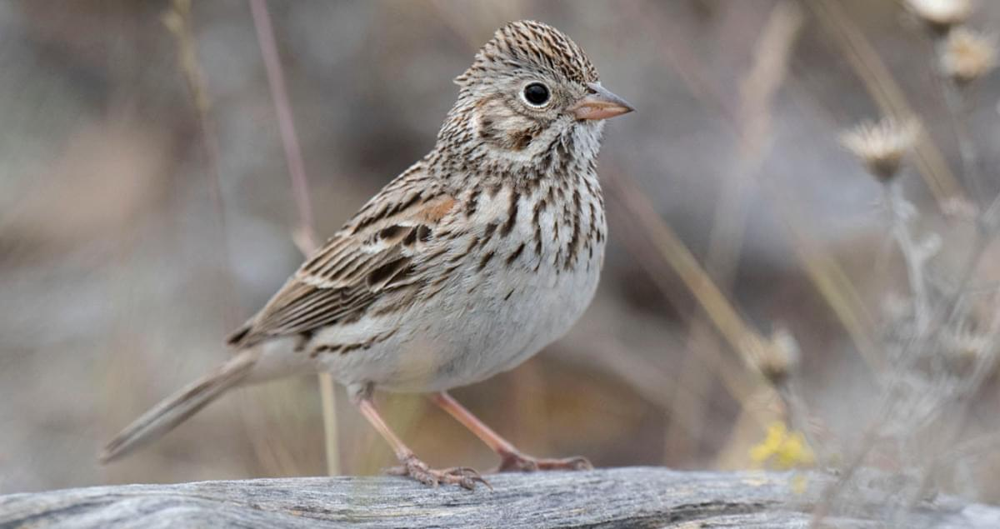

<body style="background-color:#e7d5ad"> 
<center>{width=80%}</center>
---
title: "Introduction to Model Selection"
#subtitle: Jenna Atma
output:
  html_document:
    toc: yes
---

```{r setup, include=FALSE}
knitr::opts_chunk$set(echo = TRUE)
packages_needed <- c("ggplot2", # graphics
                     "dplyr",
                     "lme4", # display() etc.
                     "lmerTest", #gives us P-values
                     "MuMIn", #models selection
                     "GGally", #to make pairs plot
                     "performance", #model diagnostics
                     "patchwork"
                     )
pk_to_install <- packages_needed [!( packages_needed %in% rownames(installed.packages())  )]
if(length(pk_to_install)>0 ){
  install.packages(pk_to_install,repos="http://cran.r-project.org")
}
#lapply(packages_needed, require, character.only = TRUE)
library(ggplot2)
library(dplyr)
library(lme4)
library(lmerTest)
library(ggfortify)
library(MuMIn)
library(GGally)
library(performance)
library(patchwork)
```

```{r include = FALSE}
knitr::opts_chunk$set(warning = FALSE, message = FALSE)
```

Dataset: Harrower, William L.; Srivastava, Diane S.; Turkington, Roy; Fraser, Lauchlan H. (2018), Data from: Temperate grassland songbird species accumulate incrementally along a gradient of primary productivity, Dryad, Dataset, https://doi.org/10.5061/dryad.365dr

## Background

<center>{width=80%}</center>
  
Global analyses of bird communities along elevation gradients suggest that bird diversity on arid mountains is primarily limited by water availability, not temperature or altitude. However, the mechanism by which water availability, and subsequently primary productivity, increases bird diversity is still unclear. Here we evaluate two possible mechanisms from species-energy theory. The more individuals hypothesis proposes that a higher availability of resources increases the total number of individuals that can be supported, and therefore the greater number of species that will be sampled. By contrast, the more specialization hypothesis proposes that increasing resource availability will permit specialists to exploit otherwise rare resources, thus increasing total diversity. 
  
This study was conducted with 5 years of surveys of grassland songbird communities along an elevational gradient in British Columbia, Canada:

<center>{width=80%}
{width=80%}</center>

Using model selection with AIC values can help find the most parsimonious model: in other words, the simplest yet most accurate model to describe these data. 

```{r}
grass<-read.csv("data/grass_data.csv")
```
Two response variables: diversity (number of species per survey point) and density (number of individuals per survey point)
Five predictor variables: elevation, NDVI (Normalized Difference Vegetation Index), live (percent live plant cover), dead (percent dead plant cover), and ground (percent ground cover).


## Visualizing the Data

Using the pairs function, the multiple competing hypotheses are plotted out, with each hypothesis being represented in a separate model.

```{r fig.height=8, fig.width=8}
#check for co-linearity among the four predictor variables
pairs(grass[,5:9], lower.panel = NULL) #use all rows of columns including predictor variables
```
    
Elevation and ndvi look closely related, and some of the others look fairly linear, which means they are very likely redundant information representing the same phenomenon.
All of the combinations with percent ground cover look promising, so I'll focus on that in my analysis. 

```{r}
grassmodel <- lm(density ~ elevation + ndvi + live + dead + ground, data=grass)
anova (grassmodel) #coefficients of the full model
```

Using the performance-collinearity check function, we can check our data for multicollinearity:
```{r}
performance::check_collinearity(grassmodel)
```

All five predictors show a low correlation. 

Next, I'm going to dredge the model to run all possible variable combinations. This helps decide which combos to run actual analysis on. All should add up to "1" (weight). I want to run my analysis on the models that have less than 2.0 model units from the top-rated model (delta 0.0). These ones have the most "competitive explanatory power".

When model is dredged, it will show sum of weight and # containing models. Variables with more inclusions may be stronger/more likely to be included/have some kind of effect.

Pairwise comparison figures can help show the relationships between the different variables.

```{r}
options(na.action = "na.fail") # otherwise blows up with NA values
dredge_grass<-dredge(grassmodel)
dredge_grass
```
There are 32 possible models based on additive combinations of variables (no interaction terms).

I'm going to subset these model and isolate the top competitive model combinations:
```{r}
#grab equally competitive models
subset(dredge_grass, delta <3)
```

There are 6 models that could be considered at least close to being equally competitive (having explanatory power that is indistinguishable). The top three models are all more or less within 2 AIC units of each other.
  
Checking to see which variables are most influential:

```{r}
importance(dredge_grass)
```
Percent ground cover, percent live plant cover, and elevation all have fairly high-ranking explanatory power, but NDVI and percent dead plant cover aren't too far off. All of them are involved in the same number of models.

Just taking a look at each predictor variable against the response variable (density):
```{r, out.width="50%"}
g1 <- ggplot(grassmodel, aes(elevation, density, color = elevation)) + 
  geom_point() +
  geom_smooth(method="lm") +
  scale_colour_gradientn(colors = heat.colors(10, rev=TRUE))

g2 <- ggplot(grassmodel, aes(ndvi, density, color = ndvi)) + 
  geom_point() +
  geom_smooth(method="lm") +
  scale_colour_gradientn(colors = terrain.colors(10, rev=TRUE))

g3 <- ggplot(grassmodel, aes(live, density)) + 
  geom_point() +
  geom_smooth(method="lm")

g4 <- ggplot(grassmodel, aes(dead, density)) + 
  geom_point() +
  geom_smooth(method="lm")

g5 <- ggplot(grassmodel, aes(ground, density)) + 
  geom_point() +
  geom_smooth(method="lm")

g1 
g2
g3
g4
g5
```
Based on the top 3 candidate models, I can now run my linear models including these individual and additive variables.

I'll fit the candidate models that will likely best explain any variation in grassland bird density. Ideally, these models would represent hypotheses. 
Given the nature of the response, we’ll use ordinary linear regression with the `lm` function.
```{r}
#First, fit 4 candidate linear models to explain variation in density
mod1<-lm(density~elevation+ground+live, data = grass)
mod2<-lm(density~elevation+ground+live+dead, data = grass)
mod3<-lm(density~elevation+ground+live+ndvi, data = grass)
```
We can now use the `model.sel` function to conduct model selection. The default model selection criteria is Akaike’s information criteria (AIC) with small sample bias adjustment, AIC~c~. Here we’ll create an object `out.put` that contains all of the model selection information.
```{r}
# use the model.sel function to conduct model selection
out.put<-model.sel(mod1,mod2,mod3)
out.put
```
The models are sorted from best (top) to worst (bottom). Looks like `mod1`, containing an intercept, elevation, percent ground cover, and percent live cover is best with a weight of 0.568. It is 0.586/0.211 = 2.78 times more likely to be the best explanation (hypothesis) for variation in density. When comparing the best model to the third-best model, we get 0.586/0.203 = 2.89 times more likely to be the best explanation (hypothesis).

```{r Royall}
# select models using Royall's 1/8 rule for strength of evidence
#https://www.stat.fi/isi99/proceedings/arkisto/varasto/roya0578.pdf
# IMPORTANT: Weights have been renormalized!!
subset(out.put, 1/8 < weight/max(out.put$weight))
```
Using the 1/8 rule for strength of evidence, we can see that the delta values and weights agree with each other.

```{r}
# select models 95% cumulative weight criteria
# IMPORTANT: Weights have been renormalized!!
subset(out.put, cumsum(out.put$weight) <= .95)
```
0.735/0.265 = model 1 is 2.77% more likely than model 2.

```{r adjusting sig digits}
# coerce the object out.put into a data frame
# elements 6-10 in out.put have what we want
sel.table<-as.data.frame(out.put)[6:10]
sel.table
# how about a little renaming columns to fit proper conventions
# number of parameters (df) should be K
names(sel.table)[1] = "K"

## lets be sure to put the model names in a column
sel.table$Model<-rownames(sel.table)

# let's see what is in there
sel.table
```

```{r reorder columns}
#little reordering of columns
sel.table<-sel.table[,c(6,1,2,3,4,5)] #specify order of columns
sel.table
```

<center>{width=90%}</center>

## Caveats and Limitations to Model Selection

1. Depends on the models included in the candidate set. You can’t identify a model as being the “best” fit to the data if you didn’t include the model to begin with!  
\
2. The parameter estimates and predictions arising from the “best” model or set of best models should be biologically meaningful.  
\
3. Need to decide whether to use model selection or common inferential statistics (e.g. based on P-values). Techniques that rely on both approaches are possible (e.g. backward variable selection followed by averaging of top models) but are discouraged by some model-selection purists.  
\
4. Difficult or impossible to compare models with different assumptions, such as those with different error structures (e.g., Poisson vs. Binomial data).  