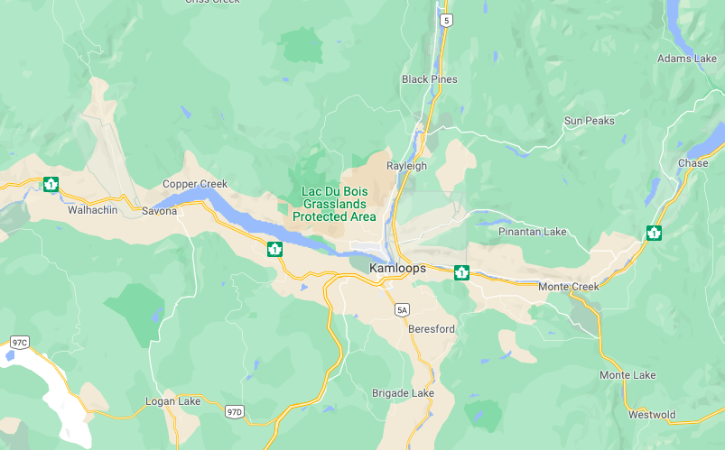

<body style="background-color:#e7d5ad"> 
<center>{width=80%}</center>
---
title: "Model Selection"
#subtitle: Jenna Atma
output:
  html_document:
    toc: yes
---

```{r setup, include=FALSE}
knitr::opts_chunk$set(echo = TRUE)
packages_needed <- c("ggplot2", # graphics
                     "dplyr",
                     "lme4", # display() etc.
                     "lmerTest", #gives us P-values
                     "MuMIn", #models selection
                     "GGally", #to make pairs plot
                     "performance", #model diagnostics
                     "patchwork"
                     )
pk_to_install <- packages_needed [!( packages_needed %in% rownames(installed.packages())  )]
if(length(pk_to_install)>0 ){
  install.packages(pk_to_install,repos="http://cran.r-project.org")
}
#lapply(packages_needed, require, character.only = TRUE)
library(ggplot2)
library(dplyr)
library(lme4)
library(lmerTest)
library(ggfortify)
library(MuMIn)
library(GGally)
library(performance)
library(patchwork)
```

```{r include = FALSE}
knitr::opts_chunk$set(warning = FALSE, message = FALSE)
```

<center>Dataset: Harrower, William L.; Srivastava, Diane S.; Turkington, Roy; Fraser, Lauchlan H. (2018), Data from: Temperate grassland songbird species accumulate incrementally along a gradient of primary productivity, Dryad, Dataset, https://doi.org/10.5061/dryad.365dr</center>

## Background

<center>{width=80%}</center>
  
Global analyses of bird communities along elevation gradients suggest that bird diversity on arid mountains is primarily limited by water availability, not temperature or altitude. However, the mechanism by which water availability, and subsequently primary productivity, increases bird diversity is still unclear. Here we evaluate two possible mechanisms from species-energy theory. The more individuals hypothesis proposes that a higher availability of resources increases the total number of individuals that can be supported, and therefore the greater number of species that will be sampled. By contrast, the more specialization hypothesis proposes that increasing resource availability will permit specialists to exploit otherwise rare resources, thus increasing total diversity. 
  
This study was conducted with 5 years of surveys of grassland songbird communities along an elevational gradient in British Columbia, Canada:

<center>{width=80%}
{width=80%}</center>

Using model selection with AIC values can help find the most parsimonious model: in other words, the simplest yet most accurate model to describe these data. 

```{r}
grass<-read.csv("data/grass_data.csv")
```
Two response variables: diversity (number of species per survey point) and density (number of individuals per survey point)
Five predictor variables: elevation, NDVI (Normalized Difference Vegetation Index), live (percent live plant cover), dead (percent dead plant cover), and ground (percent ground cover).


## Visualizing the Data

Using the pairs function, the multiple competing hypotheses are plotted out, with each hypothesis being represented in a separate model.

```{r, fig.align="center"}
grassdensity <- grass[, c("density", "elevation", "ndvi", "live", "dead", "ground")]

ggpairs(grassdensity) + theme_bw()
```
    
There's several models in this ggpairs plot that seem to show a high level or collinearity. This might not be a big deal, but we need to consider to what degree variables are co-linear (to what degree do they inform us about the same phenomenon of interest). Elevation, ground cover, and ndvi look closely related, and some of the others look fairly linear, which means they are very likely redundant information representing the same phenomenon.

```{r}
grassmodel <- lm(density ~ elevation + ndvi + live + dead + ground, data=grass)
anova (grassmodel) #coefficients of the full model
```

Using the performance-collinearity check function, we can check our data for multicollinearity:
```{r}
performance::check_collinearity(grassmodel)
```
Multicollinearity is when you know the effect of one predictor, the value of knowing the other predictor is rather low; thus, one of the predictors doesn’t help much in terms of better understanding the model or predicting the outcome. 
If multicollinearity is a problem, the model would suggest that the predictors in question don’t seems to be reliably associated with the outcome (low estimates, high standard errors), although these predictors actually are strongly associated with the outcome, i.e. indeed might have strong effect.

All five predictors show a low correlation. 

## Dredging the Model

Next, I'm going to dredge the model to run all possible variable combinations. This helps decide which combos to run actual analysis on. All should add up to "1" (weight). I want to run my analysis on the models that have less than 2.0 model units from the top-rated model (delta 0.0). These ones have the most "competitive explanatory power".

When model is dredged, it will show sum of weight and # containing models. Variables with more inclusions may be stronger/more likely to be included/have some kind of effect.

Pairwise comparison figures can help show the relationships between the different variables.

```{r}
options(na.action = "na.fail") # otherwise blows up with NA values
dredge_grass<-dredge(grassmodel)
dredge_grass
```
There are 32 possible models based on additive combinations of variables (no interaction terms).

I'm going to subset these model and isolate the top competitive model combinations:
```{r}
#grab equally competitive models
subset(dredge_grass, delta <3)
```

There are 6 models that could be considered at least close to being equally competitive (having explanatory power that is indistinguishable). The top three models are all more or less within 2 AIC units of each other.
  
Checking to see which variables are most influential:

```{r}
importance(dredge_grass)
```
Percent ground cover, percent live plant cover, and elevation all have fairly high-ranking explanatory power, but NDVI and percent dead plant cover aren't too far off. All of them are involved in the same number of models.

Just taking a look at each predictor variable against the response variable (density):
```{r, out.width="50%", fig.align="center"}
g1 <- ggplot(grassmodel, aes(elevation, density, color = elevation)) + 
  geom_point() +
  geom_smooth(method="lm") 

g2 <- ggplot(grassmodel, aes(ndvi, density, color = ndvi)) + 
  geom_point() +
  geom_smooth(method="lm") 

g3 <- ggplot(grassmodel, aes(live, density, color = live)) + 
  geom_point() +
  geom_smooth(method="lm")

g4 <- ggplot(grassmodel, aes(dead, density, color = dead)) + 
  geom_point() +
  geom_smooth(method="lm")

g5 <- ggplot(grassmodel, aes(ground, density, color = ground)) + 
  geom_point() +
  geom_smooth(method="lm")

g1 
g2
g3
g4
g5
```
Based on the top 3 candidate models, I can now run my linear models including these individual and additive variables.

## Running the Actual Model

I can fit the candidate models that will likely best explain any variation in grassland bird density. Given the nature of the response, I’ll use ordinary linear regression.

```{r}
mod1<-lm(density~elevation+ground+live, data = grass)
mod2<-lm(density~elevation+ground+live+dead, data = grass)
mod3<-lm(density~elevation+ground+live+ndvi, data = grass)
```

Using the `model.sel` function, I can do the model selection using Akaike’s information criteria (AIC).
```{r}
out.put<-model.sel(mod1,mod2,mod3)
out.put
```
The models are sorted from best (top) to worst (bottom). Looks like `mod1`, containing an intercept, elevation, percent ground cover, and percent live cover is best with a weight of 0.568. It is 0.586/0.211 = 2.78 times more likely to be the best explanation (hypothesis) for variation in density. When comparing the best model to the third-best model, we get 0.586/0.203 = 2.89 times more likely to be the best explanation (hypothesis).

```{r Royall}
# select models using Royall's 1/8 rule for strength of evidence
subset(out.put, 1/8 < weight/max(out.put$weight))
```
Using the 1/8 rule for strength of evidence, we can see that the delta values and weights agree with each other.

```{r adjusting sig digits}
sel.table<-as.data.frame(out.put)[2:9]
sel.table$Model<-rownames(sel.table)
sel.table[,2:3]<- round(sel.table[,2:5],2)
sel.table[,4:5]<- round(sel.table[,4:5],2)
names(sel.table)[7] = "K"
names(sel.table)[5] = "NDVI"
names(sel.table)[4] = "% Dead Plants"
names(sel.table)[3] = "% Live Plants"
names(sel.table)[2] = "% Ground Cover"
names(sel.table)[1] = "Elevation"
sel.table$Model<-rownames(sel.table)
sel.table<-sel.table[,c(9,7,1,2,3,4,5,8)]

sel.table
```

## Averaging the Models

```{r}
MA<-model.avg(out.put, revised.var = TRUE)
MA
```
Model averaging incorporates model selection uncertainty. The parameter estimates for each candidate model are weighted using their corresponding model weights and summed. 
Two methods for model-averaging: where parameter estimates are averaged over all models in which predictor Xi occurs, and where parameter estimates are averaged over all models, not just those in which predictor Xi occurs.
MuMIn function model.avg conducts both types of model averaging and reports the first type of model averaging as “subset” and the second type as “full”.

```{r}
summary(model.avg(out.put))
```
  
  
  
<center>{width=80%}</center>

  
## Visualizing the Data Part 2

Using the same dataset, I'm going to do the same kind of model selection, but looking at my predictor variables and using bird **diversity** as my response variable.

```{r, fig.align="center"}
grassdiversity <- grass[, c("diversity", "elevation", "ndvi", "live", "dead", "ground")]

ggpairs(grassdiversity) + theme_bw()
```

Elevation looks the most significant, but many of these models look promising.

```{r}
grassmodel2 <- lm(diversity ~ elevation + ndvi + live + dead + ground, data=grass)
anova (grassmodel2)
```
Only elevation shows significance in an ANOVA of the linear model.

Using the performance-collinearity check function, we can check our data for multicollinearity:
```{r}
performance::check_collinearity(grassmodel2)
```

All five predictors show a low correlation. 

## Dredging the Second Model

```{r}
options(na.action = "na.fail")
dredge_grass2<-dredge(grassmodel2)
dredge_grass2
```
There are 32 possible models based on additive combinations of variables (no interaction terms).

I'm going to subset these model and isolate the top competitive model combinations:
```{r}
subset(dredge_grass2, delta <2)
```
There are 2 models that are equally competitive.
  
Checking to see which variables are most influential:
```{r}
importance(dredge_grass2)
```
Elevation clearly shows the highest-ranking explanatory power. All of them are involved in the same number of models.

## Averaging the Second Model

This time I averaged the dredged model, instead of averaging the actual models like I did for the density models. 
```{r}
MA2<-model.avg(dredge_grass2, revised.var = TRUE)
MA2
```
```{r}
summary(model.avg(dredge_grass2))
```

